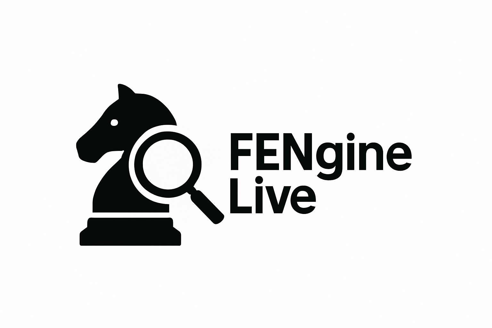

<div id="top">

<!-- HEADER STYLE: CLASSIC -->
<div align="center">



# <code>❯ FENgineLive</code>

<em>Enhancing chess gameplay visually</em>

<!-- BADGES -->
<!-- local repository, no metadata badges. -->

<em>Built with the tools and technologies:</em>


</div>
<br>

---

## Table of Contents

- [Table of Contents](#table-of-contents)
- [Overview](#overview)
- [Features](#features)
- [Project Structure](#project-structure)
    - [Project Index](#project-index)
- [Getting Started](#getting-started)
    - [Prerequisites](#prerequisites)
    - [Installation](#installation)
    - [Usage](#usage)
    - [Testing](#testing)
- [Roadmap](#roadmap)
- [Contributing](#contributing)
- [License](#license)
- [Acknowledgments](#acknowledgments)

---

## Overview

**Project Name: FENgineLive**

**Why FENgineLive?**

This project uses a custom CNN (Convolutional Neural Network) to visually scan images of chessboards and turn them into a FEN (Forsyth-Edwards Notation) It includes the following features:

- **🔍 Render chessboard arrows:** Enhance visualization and interaction.
- **🎯 Detect chessboard patterns:** Ensure accuracy in image analysis.
- **⌨️ Global hotkeys:** Streamline user interaction.
- **🧠 Process real-time images:** Utilize neural networks for advanced gameplay tracking.
- **🤫 Stealth mode with best-move randomization:** Uses multiple engine lines to disguise suggestions, but stops randomizing once the evaluation is clearly winning (about +3 pawns).
- **♻️ Repetition avoidance:** Detects potential threefold repetition and excludes the immediate reversal move when necessary.

---

## Features

|      | Component       | Details                              |
| :--- | :-------------- | :----------------------------------- |
| ⚙️  | **Architecture**  | <ul><li>Follows a modular design pattern</li><li>Uses CMake for build configuration</li></ul> |
| 🔩 | **Code Quality**  | <ul><li>Consistent naming conventions</li><li>Well-documented code with inline comments</li></ul> |
| 📄 | **Documentation** | <ul><li>Includes README.md and CMakeLists.txt for setup</li><li>Lacks detailed API documentation</li></ul> |
| 🔌 | **Integrations**  | <ul><li>Integrates with OpenCV and Qt libraries</li><li>Uses C++ for backend and Python for scripting</li></ul> |
| 🧩 | **Modularity**    | <ul><li>Separate modules for GUI, image processing, and model loading</li><li>Encourages code reusability</li></ul> |
| 🧪 | **Testing**       | <ul><li>Includes unit tests for critical functions</li><li>Utilizes CMake for test configuration</li></ul> |
| ⚡️  | **Performance**   | <ul><li>Optimizes image processing algorithms</li><li>Utilizes multi-threading for parallel execution</li></ul> |
| 🛡️ | **Security**      | <ul><li>Implements secure file handling practices</li><li>Sanitizes user inputs to prevent vulnerabilities</li></ul> |
| 📦 | **Dependencies**  | <ul><li>Relies on OpenCV, Qt, and CMake for building</li><li>Includes pre-trained model file ccn_model_default.pth</li></ul> |

---

## Project Structure

```sh
└── /
    ├── AGENTS.md
    ├── arrowoverlay.cpp
    ├── arrowoverlay.h
    ├── assets
    │   ├── .qtcreator
    │   ├── fonts
    │   ├── pieces
    │   └── style.qss
    ├── boardwidget.cpp
    ├── boardwidget.h
    ├── chessboard_detector.cpp
    ├── chessboard_detector.h
    ├── CMakeLists.txt
    ├── CMakeLists.txt.user
    ├── CMakeLists.txt.user.1933d4e
    ├── CMakeLists.txt.user.baaa37e
    ├── CMakeLists.txt.user.fbe624f
    ├── globalhotkeymanager.cpp
    ├── globalhotkeymanager.h
    ├── main.cpp
    ├── mainwindow.cpp
    ├── mainwindow.h
    ├── mainwindow.ui
    ├── python
    │   └── fen_tracker
    ├── README.md
    ├── regionselector.cpp
    ├── regionselector.h
    ├── settingsdialog.cpp
    ├── settingsdialog.h
    └── stockfish.exe
```

### Project Index

<details open>
	<summary><b><code>/</code></b></summary>
	<!-- __root__ Submodule -->
	<details>
		<summary><b>__root__</b></summary>
		<blockquote>
			<div class='directory-path' style='padding: 8px 0; color: #666;'>
				<code><b>⦿ __root__</b></code>
			<table style='width: 100%; border-collapse: collapse;'>
			<thead>
				<tr style='background-color: #f8f9fa;'>
					<th style='width: 30%; text-align: left; padding: 8px;'>File Name</th>
					<th style='text-align: left; padding: 8px;'>Summary</th>
				</tr>
			</thead>
				<tr style='border-bottom: 1px solid #eee;'>
					<td style='padding: 8px;'><b><a href='/arrowoverlay.cpp'>arrowoverlay.cpp</a></b></td>
					<td style='padding: 8px;'>- Render chessboard arrows and highlights based on user input, enhancing visualization and interaction<br>- Map squares to positions and centers, adjusting for orientation<br>- Utilize antialiasing for smooth lines and a teal color scheme for aesthetics<br>- Implement arrow drawing with proper angles and styles, enriching the user experience.</td>
				</tr>
				<tr style='border-bottom: 1px solid #eee;'>
					<td style='padding: 8px;'><b><a href='/arrowoverlay.h'>arrowoverlay.h</a></b></td>
					<td style='padding: 8px;'>- Define a custom QWidget for displaying arrows and highlights<br>- Implement methods to set arrow positions and highlights<br>- The class manages arrow data and rendering logic for visual overlays within the projects architecture.</td>
				</tr>
				<tr style='border-bottom: 1px solid #eee;'>
					<td style='padding: 8px;'><b><a href='/boardwidget.cpp'>boardwidget.cpp</a></b></td>
					<td style='padding: 8px;'>- Implement a board widget for a chess game<br>- Translate chess positions to screen coordinates, parse FEN notation, and render the board with pieces<br>- Dynamically adjust piece sizes and handle resizing events<br>- Display arrows indicating moves<br>- This widget enhances the user interface for a chess application.</td>
				</tr>
				<tr style='border-bottom: 1px solid #eee;'>
					<td style='padding: 8px;'><b><a href='/boardwidget.h'>boardwidget.h</a></b></td>
					<td style='padding: 8px;'>- Define a custom QWidget for managing a chess board display<br>- Implement methods for setting board positions, displaying arrows, and handling paint and resize events<br>- Utilize cached piece images and color settings for squares<br>- This class encapsulates board functionality for the larger application architecture.</td>
				</tr>
				<tr style='border-bottom: 1px solid #eee;'>
					<td style='padding: 8px;'><b><a href='/chessboard_detector.cpp'>chessboard_detector.cpp</a></b></td>
					<td style='padding: 8px;'>- Detects chessboard rectangles from images by identifying prominent horizontal and vertical lines<br>- Utilizes image processing techniques like edge detection and contour analysis to find the best-fitting rectangle<br>- Offers debug options for visualization<br>- Designed to improve accuracy over previous methods, especially on noisy image captures.</td>
				</tr>
				<tr style='border-bottom: 1px solid #eee;'>
					<td style='padding: 8px;'><b><a href='/chessboard_detector.h'>chessboard_detector.h</a></b></td>
					<td style='padding: 8px;'>Detects chessboard patterns in images using the provided file.</td>
				</tr>
				<tr style='border-bottom: 1px solid #eee;'>
					<td style='padding: 8px;'><b><a href='/CMakeLists.txt'>CMakeLists.txt</a></b></td>
					<td style='padding: 8px;'>- Define and configure the ChessGUI project using CMakeLists.txt<br>- Set up Qt components, define project sources, handle different Qt versions, and manage target properties<br>- Install necessary dependencies, copy directories, and configure packaging for deployment<br>- Include OpenCV, MSVC runtime, and NSIS installer settings<br>- This file orchestrates the projects build, dependencies, and deployment processes seamlessly.</td>
				</tr>
				<tr style='border-bottom: 1px solid #eee;'>
					<td style='padding: 8px;'><b><a href='/CMakeLists.txt.user'>CMakeLists.txt.user</a></b></td>
					<td style='padding: 8px;'>- SummaryThe <code>CMakeLists.txt.user</code> file in this project contains configuration settings for the QtCreator IDE<br>- It specifies environment variables, project targets, and editor settings such as auto-detection, auto-indentation, and camel case navigation<br>- This file helps in defining the projects development environment within QtCreator, ensuring consistent coding styles and preferences across the team.</td>
				</tr>
				<tr style='border-bottom: 1px solid #eee;'>
					<td style='padding: 8px;'><b><a href='/CMakeLists.txt.user.1933d4e'>CMakeLists.txt.user.1933d4e</a></b></td>
					<td style='padding: 8px;'>- SummaryThe <code>CMakeLists.txt.user.1933d4e</code> file is a configuration file that stores specific settings related to the QtCreator project environment<br>- It contains data such as the active target within the project, editor settings like auto-detection and auto-indentation, and code style configurations for languages like C++<br>- This file plays a crucial role in defining the development environment and preferences for the project within QtCreator.</td>
				</tr>
				<tr style='border-bottom: 1px solid #eee;'>
					<td style='padding: 8px;'><b><a href='/CMakeLists.txt.user.baaa37e'>CMakeLists.txt.user.baaa37e</a></b></td>
					<td style='padding: 8px;'>- The <code>CMakeLists.txt.user.baaa37e</code> file in the project structure contains configuration settings for the QtCreator IDE<br>- It specifies environment variables, project targets, and editor settings such as auto-detection, auto-indentation, and code style preferences<br>- This file plays a crucial role in defining the development environment and editor behavior within the project, ensuring consistency and efficiency for developers working on the codebase.</td>
				</tr>
				<tr style='border-bottom: 1px solid #eee;'>
					<td style='padding: 8px;'><b><a href='/CMakeLists.txt.user.fbe624f'>CMakeLists.txt.user.fbe624f</a></b></td>
					<td style='padding: 8px;'>- SummaryThe <code>CMakeLists.txt.user.fbe624f</code> file is a configuration file that stores specific settings related to the project environment and editor preferences<br>- It defines the active target within the project and includes settings such as auto-detection, auto-indentation, and code style configurations<br>- This file plays a crucial role in maintaining a consistent development environment and ensuring that the project adheres to the specified coding standards and preferences.</td>
				</tr>
				<tr style='border-bottom: 1px solid #eee;'>
					<td style='padding: 8px;'><b><a href='/globalhotkeymanager.cpp'>globalhotkeymanager.cpp</a></b></td>
					<td style='padding: 8px;'>- Manage global hotkeys for cross-platform applications by registering, handling, and filtering key sequences<br>- The code facilitates the integration of system-wide hotkeys for enhanced user interaction<br>- It supports different keyboard modifiers and key combinations, ensuring seamless hotkey functionality across various operating systems.</td>
				</tr>
				<tr style='border-bottom: 1px solid #eee;'>
					<td style='padding: 8px;'><b><a href='/globalhotkeymanager.h'>globalhotkeymanager.h</a></b></td>
					<td style='padding: 8px;'>- Manages global hotkeys for cross-platform applications, enabling users to register key sequences that trigger specific actions<br>- This component integrates with the operating systems native event handling mechanisms to intercept key events and execute corresponding actions.</td>
				</tr>
				<tr style='border-bottom: 1px solid #eee;'>
					<td style='padding: 8px;'><b><a href='/main.cpp'>main.cpp</a></b></td>
					<td style='padding: 8px;'>- Initialize Qt application with custom styling, palette, font, and stylesheet<br>- Set up the main window and execute the application<br>- This code in main.cpp configures the visual aspects and behavior of the application, ensuring a cohesive and visually appealing user interface.</td>
				</tr>
				<tr style='border-bottom: 1px solid #eee;'>
					<td style='padding: 8px;'><b><a href='/mainwindow.cpp'>mainwindow.cpp</a></b></td>
					<td style='padding: 8px;'>- SummaryThe <code>mainwindow.cpp</code> file in the project is a crucial component responsible for setting up the main window of the application<br>- It handles various functionalities such as initializing user interface elements, reading and applying settings related to analysis intervals, stockfish depth, auto-move delays, and board detection settings<br>- Additionally, it manages user preferences for automatic moves and manual region settings<br>- This file plays a pivotal role in configuring the main window's behavior and appearance based on user-defined settings, enhancing the overall user experience of the application.By encapsulating these settings and UI configurations within the <code>mainwindow.cpp</code> file, the application ensures a personalized and efficient interaction for users, tailoring the chess GUI experience to individual preferences seamlessly.</td>
				</tr>
				<tr style='border-bottom: 1px solid #eee;'>
					<td style='padding: 8px;'><b><a href='/mainwindow.h'>mainwindow.h</a></b></td>
					<td style='padding: 8px;'>- Define the main window functionality for capturing, analyzing, and playing chess moves<br>- It manages region selection, board detection, settings, and integrates with Stockfish for analysis<br>- The window handles automatic move execution, evaluation, and history tracking<br>- Additionally, it supports hotkeys and event filtering for seamless user interaction.</td>
				</tr>
				<tr style='border-bottom: 1px solid #eee;'>
					<td style='padding: 8px;'><b><a href='/mainwindow.ui'>mainwindow.ui</a></b></td>
					<td style='padding: 8px;'>- Create a main window interface with various widgets for a chess analysis application<br>- The interface includes a progress bar, status indicators, chessboard display, and user controls for setting regions, starting analysis, and choosing sides<br>- It also features options for automove and stealth mode, displaying best moves, move history, FEN notation, and a menu for settings.</td>
				</tr>
				<tr style='border-bottom: 1px solid #eee;'>
					<td style='padding: 8px;'><b><a href='/regionselector.cpp'>regionselector.cpp</a></b></td>
					<td style='padding: 8px;'>- Create a region selector widget for capturing user-selected screen regions<br>- The widget allows users to draw a selection box on the screen, emitting the chosen region upon selection<br>- The widget covers the entire screen and provides a transparent overlay for selection.</td>
				</tr>
				<tr style='border-bottom: 1px solid #eee;'>
					<td style='padding: 8px;'><b><a href='/regionselector.h'>regionselector.h</a></b></td>
					<td style='padding: 8px;'>- Enables interactive selection of regions within a QWidget by capturing mouse events and drawing selection boundaries<br>- Signals the selected region upon completion.</td>
				</tr>
				<tr style='border-bottom: 1px solid #eee;'>
					<td style='padding: 8px;'><b><a href='/settingsdialog.cpp'>settingsdialog.cpp</a></b></td>
					<td style='padding: 8px;'>- Manage application settings and configurations through a user-friendly dialog interface<br>- Customize analysis intervals, Stockfish depth, board detection options, move automation settings, and more<br>- Easily browse and set paths for Stockfish and FEN models<br>- Save and reset default settings with ease.</td>
				</tr>
				<tr style='border-bottom: 1px solid #eee;'>
					<td style='padding: 8px;'><b><a href='/settingsdialog.h'>settingsdialog.h</a></b></td>
					<td style='padding: 8px;'>- Manages settings and configurations for the application, including analysis intervals, stockfish depth, and move automation<br>- Handles board detection preferences and miscellaneous options like stockfish and player color settings<br>- Allows users to browse and reset settings as needed.</td>
				</tr>
			</table>
		</blockquote>
	</details>
	<!-- python Submodule -->
	<details>
		<summary><b>python</b></summary>
		<blockquote>
			<div class='directory-path' style='padding: 8px 0; color: #666;'>
				<code><b>⦿ python</b></code>
			<!-- fen_tracker Submodule -->
			<details>
				<summary><b>fen_tracker</b></summary>
				<blockquote>
					<div class='directory-path' style='padding: 8px 0; color: #666;'>
						<code><b>⦿ python.fen_tracker</b></code>
					<table style='width: 100%; border-collapse: collapse;'>
					<thead>
						<tr style='background-color: #f8f9fa;'>
							<th style='width: 30%; text-align: left; padding: 8px;'>File Name</th>
							<th style='text-align: left; padding: 8px;'>Summary</th>
						</tr>
					</thead>
						<tr style='border-bottom: 1px solid #eee;'>
							<td style='padding: 8px;'><b><a href='/python/fen_tracker/ccn_model.py'>ccn_model.py</a></b></td>
							<td style='padding: 8px;'>- Define a neural network architecture for image classification<br>- Implement convolutional layers with batch normalization and residual blocks for feature enhancement<br>- Utilize adaptive pooling and dropout for model regularization<br>- The final output reshapes the data for classification tasks.</td>
						</tr>
						<tr style='border-bottom: 1px solid #eee;'>
							<td style='padding: 8px;'><b><a href='/python/fen_tracker/ccn_model_default.pth'>ccn_model_default.pth</a></b></td>
							<td style='padding: 8px;'>- Model weight for CCN. Customizable for different themes/boards.</td>
						</tr>
						<tr style='border-bottom: 1px solid #eee;'>
							<td style='padding: 8px;'><b><a href='/python/fen_tracker/main.py'>main.py</a></b></td>
							<td style='padding: 8px;'>- Execute the main function to process real-time chessboard images, predict game states, and track gameplay using a convolutional neural network model<br>- The function updates the game state based on image analysis, detects player turns, and outputs FEN notation accordingly<br>- The script continuously monitors and processes incoming images to maintain game state accuracy.</td>
						</tr>
						<tr style='border-bottom: 1px solid #eee;'>
							<td style='padding: 8px;'><b><a href='/python/fen_tracker/play_move.py'>play_move.py</a></b></td>
							<td style='padding: 8px;'>- Implement a function to simulate human-like mouse drags using cubic Bezier curves<br>- The function takes start and end points, adding natural randomness for a lifelike effect<br>- The main function parses input arguments to execute the drag operation, with optional stealth mode<br>- The code enhances user experience by mimicking human mouse movements during interactions.</td>
						</tr>
					</table>
					<!-- core Submodule -->
					<details>
						<summary><b>core</b></summary>
						<blockquote>
							<div class='directory-path' style='padding: 8px 0; color: #666;'>
								<code><b>⦿ python.fen_tracker.core</b></code>
							<table style='width: 100%; border-collapse: collapse;'>
							<thead>
								<tr style='background-color: #f8f9fa;'>
									<th style='width: 30%; text-align: left; padding: 8px;'>File Name</th>
									<th style='text-align: left; padding: 8px;'>Summary</th>
								</tr>
							</thead>
								<tr style='border-bottom: 1px solid #eee;'>
									<td style='padding: 8px;'><b><a href='/python/fen_tracker/core/game_state_tracker.py'>game_state_tracker.py</a></b></td>
									<td style='padding: 8px;'>- Manage game state transitions, including tracking moves, castling rights, and en passant<br>- Detect changes in the board to update game status and generate FEN notation<br>- Ensure accurate representation of the game state for chess gameplay.</td>
								</tr>
								<tr style='border-bottom: 1px solid #eee;'>
									<td style='padding: 8px;'><b><a href='/python/fen_tracker/core/move_detector.py'>move_detector.py</a></b></td>
									<td style='padding: 8px;'>- Detects chess piece movement by comparing two board states, identifying the source and destination of the move<br>- The function analyzes differences between the previous and current board configurations to determine the pieces new position<br>- It ensures that only valid moves with specific numbers of changes are considered, returning the coordinates of the moved piece.</td>
								</tr>
								<tr style='border-bottom: 1px solid #eee;'>
									<td style='padding: 8px;'><b><a href='/python/fen_tracker/core/turn_detector.py'>turn_detector.py</a></b></td>
									<td style='padding: 8px;'>- Detects the players turn based on changes between two chessboard images<br>- Splits images into squares, compares them using SSIM, and identifies differences to determine the players move.</td>
								</tr>
							</table>
						</blockquote>
					</details>
					<!-- utils Submodule -->
					<details>
						<summary><b>utils</b></summary>
						<blockquote>
							<div class='directory-path' style='padding: 8px 0; color: #666;'>
								<code><b>⦿ python.fen_tracker.utils</b></code>
							<table style='width: 100%; border-collapse: collapse;'>
							<thead>
								<tr style='background-color: #f8f9fa;'>
									<th style='width: 30%; text-align: left; padding: 8px;'>File Name</th>
									<th style='text-align: left; padding: 8px;'>Summary</th>
								</tr>
							</thead>
								<tr style='border-bottom: 1px solid #eee;'>
									<td style='padding: 8px;'><b><a href='/python/fen_tracker/utils/board_utils.py'>board_utils.py</a></b></td>
									<td style='padding: 8px;'>- Transforms chess board positions from one perspective to another, maintaining game state integrity<br>- Handles conversion between FEN notation and board matrices, allowing for easy manipulation and analysis of chess positions<br>- The code facilitates flipping the boards point of view, crucial for various chess-related applications.</td>
								</tr>
								<tr style='border-bottom: 1px solid #eee;'>
									<td style='padding: 8px;'><b><a href='/python/fen_tracker/utils/dataset.py'>dataset.py</a></b></td>
									<td style='padding: 8px;'>- Define a dataset for a chessboard image classification task<br>- Converts FEN notation to a matrix, loads images, and maps labels for training<br>- Organizes data for efficient model training.</td>
								</tr>
							</table>
						</blockquote>
					</details>
				</blockquote>
			</details>
		</blockquote>
	</details>
</details>

---

## Getting Started

### Prerequisites

This project requires the following dependencies:

- **Programming Language:** CPP
- **Package Manager:** Cmake

### Installation

Build  from the source and intsall dependencies:

1. **Clone the repository:**

    ```sh
    ❯ git clone ../
    ```

2. **Navigate to the project directory:**

    ```sh
    ❯ cd 
    ```

3. **Install the dependencies:**

<!-- SHIELDS BADGE CURRENTLY DISABLED -->
	<!-- [![cmake][cmake-shield]][cmake-link] -->
	<!-- REFERENCE LINKS -->
	<!-- [cmake-shield]: https://img.shields.io/badge/C++-00599C.svg?style={badge_style}&logo=c%2B%2B&logoColor=white -->
	<!-- [cmake-link]: https://isocpp.org/ -->

	**Using [cmake](https://isocpp.org/):**

	```sh
	❯ cmake . && make
	```

### Usage

Run the project with:

**Using [cmake](https://isocpp.org/):**
```sh
./
```

### Testing

 uses the {__test_framework__} test framework. Run the test suite with:

**Using [cmake](https://isocpp.org/):**
```sh
ctest
```

---

## Roadmap

- [X] **`Task 1`**: <strike>Implement core functionality.</strike>
- [ ] **`Task 2`**: Implement visual polish
- [ ] **`Task 3`**: Implement smart features

---

## Contributing

- **💬 [Join the Discussions](https://LOCAL///discussions)**: Share your insights, provide feedback, or ask questions.
- **🐛 [Report Issues](https://LOCAL///issues)**: Submit bugs found or log feature requests for the `` project.
- **💡 [Submit Pull Requests](https://LOCAL///blob/main/CONTRIBUTING.md)**: Review open PRs, and submit your own PRs.

<details closed>
<summary>Contributing Guidelines</summary>

1. **Fork the Repository**: Start by forking the project repository to your LOCAL account.
2. **Clone Locally**: Clone the forked repository to your local machine using a git client.
   ```sh
   git clone .
   ```
3. **Create a New Branch**: Always work on a new branch, giving it a descriptive name.
   ```sh
   git checkout -b new-feature-x
   ```
4. **Make Your Changes**: Develop and test your changes locally.
5. **Commit Your Changes**: Commit with a clear message describing your updates.
   ```sh
   git commit -m 'Implemented new feature x.'
   ```
6. **Push to LOCAL**: Push the changes to your forked repository.
   ```sh
   git push origin new-feature-x
   ```
7. **Submit a Pull Request**: Create a PR against the original project repository. Clearly describe the changes and their motivations.
8. **Review**: Once your PR is reviewed and approved, it will be merged into the main branch. Congratulations on your contribution!
</details>

<details closed>
<summary>Contributor Graph</summary>
<br>
<p align="left">
   <a href="https://LOCAL{///}graphs/contributors">
      
   </a>
</p>
</details>

---

## License

 FENgineLive is protected under the GPL [LICENSE](https://choosealicense.com/licenses/gpl-3.0/) License. For more details, refer to the [LICENSE](https://choosealicense.com/licenses/gpl-3.0/) file.

---

## Acknowledgments

- Credit `William Samiri`, `Chess.com, LiChess, Atom Boghossian, David Hernandez, Veer Joshi`, `references`, etc.

<div align="right">

[![][back-to-top]](#top)

</div>


[back-to-top]: https://img.shields.io/badge/-BACK_TO_TOP-151515?style=flat-square


---
